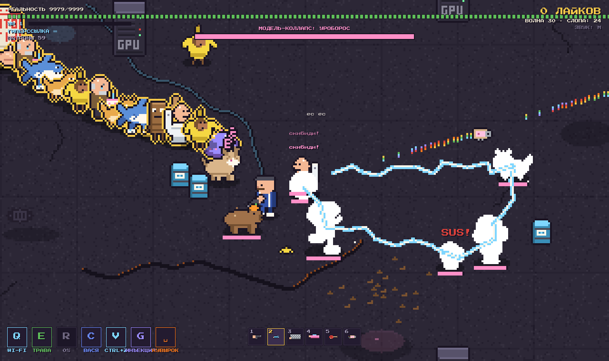

# Slop Shooter

Пиксельный wave-шутер в духе Alien Shooter. Нейрослоп вытек из датацентра в реальность, и Геннадий Пятипалов, последний человек с пятью пальцами, держит парковку.



- **Играть:** https://enikey87.github.io/slop-shooter/
- **Дизайн-документ:** https://claude.ai/code/artifact/7178ddbb-80f7-4103-9e61-72e0da9764b3

## Запуск

```sh
npm install
npm run dev        # игра с горячей перезагрузкой
npm run build      # проверка типов + сборка в один файл dist/index.html
npm test           # тесты симуляции (Vitest, без браузера)
npm run balance    # бот играет 8 забегов по 10 минут; SEEDS=20 MINUTES=15 npm run balance
npm run weapons    # стенд оружия: каждая пушка против роя, танков, летунов, стрелков и волн
```

`?seed=123` в адресе — воспроизводимый забег.

## Как устроено

TypeScript (strict) + Vite, сборка в один HTML через vite-plugin-singlefile. Рендер — Canvas 2D.

```
src/
  content/     данные: враги, боссы, пушки, перки, тексты, палитра, звуки, музыка, пиксельные спрайты
  engine/      без знания об игре: seeded RNG, фиксированный шаг 60 Гц, сетка пикселей, листы спрайтов, синтезатор
  game/        симуляция — без DOM и WebAudio
    state.ts       всё состояние забега (GameState, Player, Enemy, снаряды…)
    sim.ts         один тик: newGame(seed), step(dt, input)
    world.ts       текущий забег + хуки наружу (звук, пятна на полу, экраны)
    enemies/       общий цикл ИИ, поведения обычных врагов, пространственный хеш
    bosses/        по файлу на босса + смена фаз
    inventory.ts   4 слота, уровни пушек, ящики с выбором
    weapons.ts     основной и альтернативный огонь, механики уровней
    …              combat, waves, abilities, pickups, hazards, allies, bullets, perks, bot
  render/      canvas, пол, мир в низком разрешении, HUD
  ui/          ввод (клава, мышь, тач → TickInput), HTML-экраны, тачбар
  main.ts      собирает всё вместе
tests/         детерминизм, волны, фазы всех боссов, все пушки, трёхминутный забег ботом
tools/         симулятор баланса
```

- **Детерминизм.** Симуляция тикает фиксированным шагом, случайность — только через seeded RNG (`engine/rng.ts`); визуальная случайность — отдельный `vrnd`. Один seed + один ввод = один и тот же забег, поэтому тесты и бот работают без браузера.
- **Графика:** пиксель-арт генерируется кодом. Каждый спрайт рисуется попиксельно по палитре, для каждого кадра код строит свою позу, контур добавляется автоматически. Мир рисуется в маленький буфер и растягивается без сглаживания.
- **Звук:** эффекты синтезируются через WebAudio, чиптюн-музыка идёт через step-секвенсор.
- **Шрифты:** Press Start 2P и JetBrains Mono (Google Fonts).

## Управление

| Клавиши | Действие |
|---|---|
| WASD, мышь | ходить, целиться и стрелять |
| 1–4, колесо, Tab | слоты: табельное, поток, тяжёлое, прикол |
| T / X | взять пушку с пола / перегенерировать ящик |
| Пробел | кувырок |
| Q / E / R | Wi-Fi / трава / блэкаут |
| C / V / G | дядя Вася / Ctrl+Z / промпт-инъекция |
| ПКМ / Z | альтернативный огонь |
| F | поздравить деда |
| P / M / N | пауза / звук / сменить трек |

На телефоне: левый палец ходит, правый стреляет, кнопки способностей снизу справа.

## Содержимое

- 14 пушек в 4 слотах по классам, у каждой своя роль и альтернативный огонь. Пушка качается убийствами до 5 уровня: 3-й и 5-й уровни добавляют новую механику.
- Враги: руки, нейрокоты, Спагетти-Уилл, голем-вывеска, Креветочный Иисус, Тралалеро Тралала, Бомбардиро Крокодило, Тун Тун Сахур, Балерина Капучина, астронавт с лошадью, грустный дед с тортом, скибиди-туалет, Чимпанзини Бананини, амогус, доге, капибара, троллфейс, Бррр Бррр Патапим, Шлёпа, Лирили Ларила, Six Seven, OIIA-кот, сигма-бой, квадроберы, лабубу.
- Боссы каждую 5-ю волну: Креветочный Иисус → Мама Промпт → Бомбардиро MEGA → Скибиди-Унитаз Прайм → Великая Шлёпа → Модель-Коллапс: Уроборос → финальный босс Скуф (злой двойник Геннадия).
- 7 уровней по 4 волны + босс, абсурд нарастает: парковка у датацентра → опенспейс стартапа (стендапы) → дача дяди Васи (грядки, улей, баня) → канализация скибиди (течения и смыв) → музей нейроискусства (лазеры и бабушки) → латентное пространство (карта перестраивается) → квартира скуфа (гречневая лава и реклама). После босса — портал на следующий уровень, после скуфа — бесконечный режим с модификаторами.
- Ступени врагов как цвета в Alien Shooter: черновик → финал → 8K → PRO-подписка (лечится); с финала у вида появляется свой трюк.
- Архетипы из бестиария Alien Shooter: стример-камикадзе, Джоконда-снайпер с видимым прицелом, принтер нейрослопа (гнездо), нейро-шаурма (облако).
- Элитные враги с 7 свойствами, 17 перков, 6 способностей с прокачкой до 3 уровня, боссы с уникальными механиками и фазами, разрушаемое окружение, 15 треков (9 обычных и 6 босс-треков), блайнд-боксы и дубайский шоколад.
